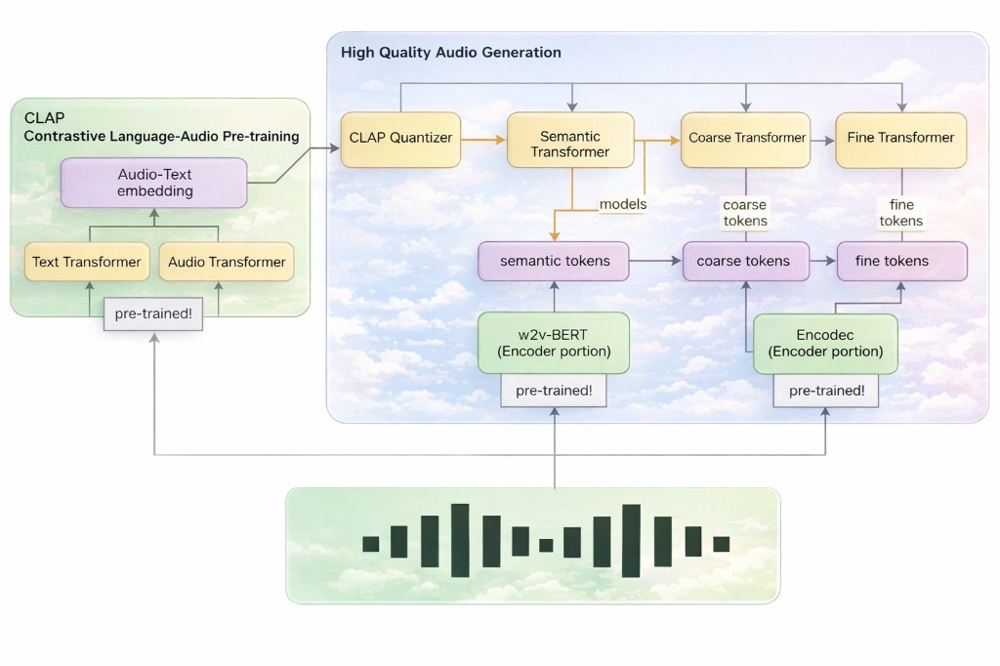

# 🎵 MusicLM: Text-Conditioned Music Generation

<div align="center">

**Generate music from text descriptions using advanced AI models**

[](https://www.python.org/)
[](https://jupyter.org/)
[](https://pytorch.org/)
[](LICENSE)

[Features](#-features) • [Quick Start](#-quick-start) • [Project Structure](#-project-structure) • [Usage](#-usage) • [Citations](#-citations)

</div>

---

## 📖 Overview

**MusicLM** is an innovative approach to generating music in the raw audio domain conditioned with text inputs. This project implements a variant of the MusicLM architecture, enhanced with CLAP (Contrastive Language-Audio Pre-training) embeddings and EnCodec audio codec.

### Key Innovations

- 🎼 **CLAP Integration**: Replaced MuLan with CLAP for improved music-text embeddings
- 🔊 **EnCodec Codec**: Switched from SoundStream to EnCodec for better audio encoding
- 🤖 **LLM-Enhanced Dataset**: Fine-tuned CLAP using ChatGPT-generated musical captions
- 🎯 **Hierarchical Generation**: Auto-regressive music generation using discrete tokens



---

## ✨ Features

- 🎵 **Text-to-Music Generation**: Create music from natural language descriptions
- 📊 **Multiple Notebooks**: Comprehensive Jupyter notebooks for training and evaluation
- ☁️ **Cloud Deployment**: AWS Lambda functions and Terraform infrastructure
- 🔬 **Evaluation Metrics**: FAD (Fréchet Audio Distance) and quality comparison tools
- 📈 **Dataset Generation**: Tools for creating music-text paired datasets

---

## 🚀 Quick Start

### Prerequisites

- Python 3.8+
- Jupyter Notebook
- CUDA-capable GPU (recommended for training)

### Installation

1. **Clone the repository**
   ```bash
   git clone https://github.com/Utkrisht12/Text-to-music-Generation.git
   cd Text-to-music-Generation
   ```

2. **Create virtual environment**
   ```bash
   python -m venv venv
   source venv/bin/activate  # On Windows: venv\Scripts\activate
   ```

3. **Install dependencies**
   ```bash
   pip install -r requirements.txt
   pip install laion_clap pydub webdataset librosa soundfile
   ```

4. **Launch Jupyter**
   ```bash
   jupyter notebook
   ```

5. **Start with the test notebook**
   - Navigate to `source/notebooks/`
   - Open `Data_display.ipynb` to verify your setup

📚 **For detailed setup instructions**, see [SETUP_GUIDE.md](SETUP_GUIDE.md)  
📝 **For step-by-step notebook execution**, see [STEP_BY_STEP_GUIDE.md](STEP_BY_STEP_GUIDE.md)

---

## 📁 Project Structure

```
Text-to-music-Generation/
│
├── 📓 source/
│   └── notebooks/              # Main Jupyter notebooks
│       ├── AudioLM+CLAP.ipynb          # 🎯 Main music generation notebook
│       ├── Clap_train.ipynb            # Train CLAP model
│       ├── CLAP_Dataset_gen.ipynb      # Generate CLAP dataset
│       ├── dataset_prod_music_text.ipynb # Create music-text pairs
│       ├── Data_display.ipynb           # 📊 Visualize and test data
│       ├── FAD_TRILL.ipynb              # Evaluation metrics (TRILL)
│       ├── FADvgg.ipynb                 # Evaluation metrics (VGG)
│       └── Text_quality_comparison.ipynb # Compare text quality
│
├── ☁️ deployment/               # AWS cloud deployment
│   ├── Dockerfile               # Main container image
│   ├── docker-compose.yml      # Local container orchestration
│   ├── terraform/              # Infrastructure as Code
│   │   ├── main.tf            # Terraform configuration
│   │   └── terraform.tfstate   # State file
│   │
│   ├── lambda_youtube_id/      # YouTube ID extraction Lambda
│   ├── youtube_download/       # YouTube download Lambda
│   ├── youtube_id/             # YouTube processing Lambda
│   ├── trainer_audiolm/        # AudioLM training Lambda
│   └── utils/                  # Deployment utilities
│
├── 🎨 artifacts/               # Project assets
│   └── MusicLM_architecture.png  # Architecture diagram
│
├── ⚙️ configs/                  # Configuration files
│
├── 📋 requirements.txt         # Python dependencies
├── 📖 README.md                 # This file
├── 📘 SETUP_GUIDE.md           # Detailed setup instructions
└── 📗 STEP_BY_STEP_GUIDE.md    # Notebook execution guide
```

---

## 💻 Usage

### Running Notebooks

The project is organized as Jupyter notebooks for interactive development:

1. **Test Environment** (Start here!)
   ```bash
   # Open: source/notebooks/Data_display.ipynb
   # This notebook verifies your setup and displays sample data
   ```

2. **Main Application**
   ```bash
   # Open: source/notebooks/AudioLM+CLAP.ipynb
   # This is the main music generation notebook
   ```

3. **Training CLAP**
   ```bash
   # Open: source/notebooks/Clap_train.ipynb
   # Train your own CLAP model (requires prepared dataset)
   ```

### Notebook Workflow

```
Data Display → Dataset Preparation → Training → Music Generation → Evaluation
     ↓                ↓                  ↓            ↓               ↓
Data_display   dataset_prod_    Clap_train   AudioLM+CLAP   FAD_TRILL
.ipynb         music_text.ipynb .ipynb       .ipynb         .ipynb
              CLAP_Dataset_gen                              FADvgg.ipynb
              .ipynb                                        Text_quality_
                                                             comparison.ipynb
```

### Important Notes

⚠️ **Colab to Local Migration**: The notebooks were originally designed for Google Colab. You'll need to:
- Remove Google Drive mounting code
- Update file paths from `/content/gdrive/...` to local paths
- Install packages as needed

See [STEP_BY_STEP_GUIDE.md](STEP_BY_STEP_GUIDE.md) for detailed migration instructions.

---

## 🏗️ Architecture

MusicLM combines several state-of-the-art components:

- **AudioLM**: Hierarchical discrete token generation for music
- **CLAP**: Contrastive Language-Audio Pre-training for embeddings
- **EnCodec**: Neural audio codec for efficient audio representation
- **ChatGPT**: LLM-generated captions for dataset enhancement

The model generates music by:
1. Encoding text descriptions using CLAP
2. Generating hierarchical discrete tokens autoregressively
3. Decoding tokens to audio using EnCodec

---

## ☁️ Cloud Deployment

The `deployment/` directory contains infrastructure for running on AWS:

- **Terraform**: Infrastructure as Code for AWS resources
- **Docker**: Containerized training and inference
- **Lambda Functions**: Serverless data processing
  - YouTube data extraction
  - Audio processing
  - Model training

See `deployment/README.md` (if available) for deployment instructions.

---

## 📚 Citations

This project builds upon and uses code from:

- **[audiolm-pytorch](https://github.com/lucidrains/audiolm-pytorch)** - AudioLM PyTorch implementation
- **[musiclm-pytorch](https://github.com/lucidrains/musiclm-pytorch)** - MusicLM architecture
- **[CLAP](https://github.com/LAION-AI/CLAP)** - Contrastive Language-Audio Pre-training

### Research Papers

- MusicLM: Generating Music From Text (Google Research)
- CLAP: Learning Audio Concepts from Natural Language Supervision
- EnCodec: High Fidelity Neural Audio Compression

---

## 🤝 Contributing

Contributions are welcome! Please feel free to submit a Pull Request.

---

## 📄 License

This project is open source. Please refer to the original repositories for their respective licenses.

---

## 🙏 Acknowledgments

Special thanks to the open-source community and the researchers behind AudioLM, CLAP, and EnCodec for their groundbreaking work.

---

<div align="center">

**Made with ❤️ for the music generation community**

⭐ Star this repo if you find it helpful!

</div>
